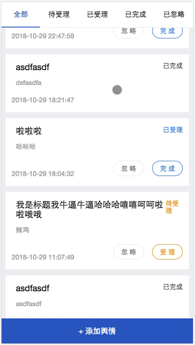

<div align="center">
  <h1>React-Screen-Navigation</h1>
</div>
<a href="https://www.npmjs.com/package/react-screen-navigation"></a> <a href="https://npm-stat.com/charts.html?package=react-screen-navigation"></a>


1.x 版本的请查看[这里](https://github.com/GoDotDotDot/react-screen-navigation/tree/1.x)，由于当前版本 breaking change 和 1.x 不兼容。 

基于React仿原生导航切换效果组件。



## Features

- 支持浏览器返回键，同时支持移动端物理返回键返回上一页
- 支持状态保存（通过分享链接后仍然能打开相应页面）
- 导航切换不影响其他dom结构，这在H5开发增强用户体验很重要
- react-router 式使用体验

## Usage

```jsx
import React, { Component } from 'react';
import { ScreenProvider, Screen, withScreen } from './lib/index';

import DetailPage from './detail';
import WeeklyPage from './weekly';

import logo from './logo.svg';
import './App.css';

class App extends Component {
  goToDetailPage = () => {
    const { go } = this.props;
    go("detail", { id: 1, name: 'godotdotdot'})
  }
  goToWeeklyPage = () => {
    const { go } = this.props;
    go("weekly")
  }
  render() {
    return (
      <div className="App">
        <Screen path="detail" component={DetailPage} />
        <Screen path="weekly" component={WeeklyPage} />
        <h1>欢迎使用 ReactScreenNavigation</h1>
        <button onClick={this.goToDetailPage}>查看详情</button>
        <button onClick={this.goToWeeklyPage}>新建周报</button>
      </div>
    );
  }
}

export default withScreen(App);


ReactDOM.render(
  <ScreenProvider history={history}>
    <App />
  </ScreenProvider>,
  document.getElementById('root'),
);
```

## Demo

线上体验地址：https://godotdotdot.github.io/react-screen-navigation/

源码请前往 [examples](https://github.com/GoDotDotDot/react-screen-navigation/tree/master/examples/create-react-app) 目录

## API

### ScreenProvider

react-screen-navigation 顶层组件，类似于 react-router 中的 Router 组件。Screen 组件必须放在它的层级下面，层级深度不限。

| 参数      | 类型   | 备注                                                         |
| --------- | ------ | ------------------------------------------------------------ |
| history   | object | history对象，同 react-router 中依赖的 history                |
| searchKey | string | 用于存储已激活的 Screen个数，该数值为位运算结果，将被存储于查询字符串中，体现在url上，该值为查询字符串键名。默认为 rsn |
| container | string | 组件被追加到的 dom 组件id，默认为 screen                     |


### Screen

对应到 react-router 的 Route 组件。表示新导航的页面。

| 参数            | 类型          | 备注                                          |
| --------------- | ------------- | --------------------------------------------- |
| path            | string        | 导航路径，用于唯一表示                        |
| component       | React.Element | 导航页面组件                                  |
| keepState       | bool          | 是否保存参数到查询字符串上，默认为 true       |
| clear           | bool          | 当导航页面出场时，是否清除该 dom，默认为 true |
| wrapedClassName | string        | 包裹 component 组件的外层容器的 className     |

Screen 组件会暴露一些 api 给 component 组件。目前暴露的有

| 参数               | 类型     | 备注                                                         |
| ------------------ | -------- | ------------------------------------------------------------ |
| match              | bool     | 表示该 Screen 是否匹配                                       |
| go                 | function | 导航到指定页面的唯一方法，请看下面 go 方法详细说明           |
| back               | function | 返回到上 n 层导航，请看下面 back 方法详细说明                |
| params             | object   | 通过 go 方法第二个参数传递给导航页面的参数                   |
| history            | object   | ScreenProvider 接收的 history 对象                           |
| searchKey          | string   | 同 ScreenProvider 中的 searchKey                             |
| activeScreens      | number   | 目前激活的导航的位操作值，值同为 searchKey 在查询字符串中的值 |
| target             | dom      | 导航页面将被渲染到的 dom 节点                                |
| updateActiveScreen | function | 可以手动调用该方法完成顶层节点的更新，从而完成导航页面的重新渲染 |


### withRouter

和 react-router 的 withRouter 类似，它是一个高阶组件，使用 withRouter 可以获得 Screen 下面暴露的一些方法，例如 go 和 back 方法。

### go(path, params)

导航至目标导航页面

| 参数   | 类型   | 备注                                                |
| ------ | ------ | --------------------------------------------------- |
| path   | string | 同 Screen 中的 path，表示导航到指定 path 的组件页面 |
| params | any    | 用户传递给screen页面的参数                          |

`params` 对象可以通过导航页面组件的`props.params`对象获取。

### back(n)

返回操作，该操作将用于导航出栈操作。指定 n 可以指定返回多少层级。注意该值为负数，默认为-1。

## 期望

后期准备加入自定义动画控制。


